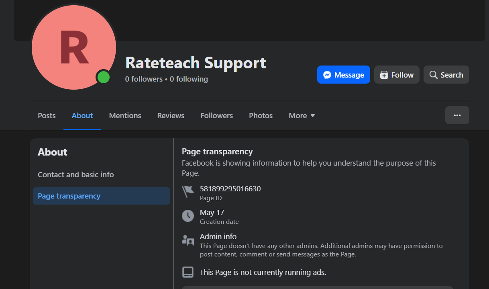

# Platform Integration

## Facebook Integration

This guide will walk you through the process of integrating your Facebook Page with our platform.

1.  **Access Settings:** Go to our settings page by clicking this link: [https://smartchatbot.click/settings](https://smartchatbot.click/settings).

2.  **Navigate to Integrations:** Click on the **`Platform Integrations`** tab.

    

3.  **Enter Your Facebook Details:** Fill in the required fields:
    * **Facebook Page ID:** Enter your unique Page ID.

        

    * **Facebook Access Token:** To obtain a Facebook Access Token, you typically need to create a Facebook Developer App and generate a User Access Token or Page Access Token with the necessary permissions. This process involves:
        1. Going to the Facebook for Developers website:
        [https://developers.facebook.com/apps/](./https://developers.facebook.com/apps/)
        2. Creating a new App or selecting an existing one.
        for creating new app -
        cilck on the `Create App ` button
        it will redirect you 
        [https://developers.facebook.com/apps/creation/](https://developers.facebook.com/apps/creation/) link. it will look like bellow
        

        give `App name` and `App contact email` here 

        3. Navigating to the "Graph API Explorer" or similar tool.
        4. Selecting your app and the desired permissions (e.g., `pages_show_list`, `pages_read_engagement`, `pages_manage_metadata`, `pages_messaging`).
        5. Generating the Access Token.
        Please refer to Facebook's official developer documentation for the most up-to-date and detailed instructions on obtaining the correct access token for your specific use case.

    * **Facebook Verify Token:** Create a unique token. For security, it's best to use one that is more than 20 characters long.

4.  **Connect:** Click the **`connect`** button.

    

---

## Verify Webhook and Permissions

After a successful connection, you must set up the webhook on Facebook's developer portal.

1.  **Go to the Webhooks Page:** Open the following URL in your browser, replacing `{APP_ID}` and `{BUSINESS_ID}` with your specific IDs.

    `https://developers.facebook.com/apps/{APP_ID}/webhooks/?business_id={BUSINESS_ID}`

    * [**How to get your APP_ID**](./how_to_get_APP_ID.md): Your APP_ID is found in your Facebook Developer App dashboard. After logging in, select your app, and the APP_ID will be prominently displayed on the dashboard or in the "Settings" -> "Basic" section.
    * [**How to get your BUSINESS_ID**](./how_to_get_BUSINESS_ID.md): Your BUSINESS_ID is associated with your Facebook Business Manager account. You can find it in your Business Manager settings under "Business Info" or "Business Settings."

    

2.  **Configure Webhook:**
    * Select the **`Pages`** tab.

        
        

    * In the provided fields, enter the **Callback URL** and **Verify Token**.
        * **Callback URL:** `https://api.smartchatbot.click/api/messaging/webhook/messenger/`
            * **Important:** Don't forget to include the `/` at the end of the URL.
        * **Facebook Verify Token:** Use the **exact same token** you entered in the previous step.

3.  **Verify and Save:** Click the **`verify and save`** button.

    

    If successful, the page will reload and show a new view.

    

4.  **Subscribe to Permissions:**
    * Go back to the **`Pages`** tab. It will now list the available permissions.

        

    * Scroll down and set the four required permissions from **`unsubscribed`** to **`subscribed`**.
    * Your final permissions should look like this:

        
        

Congratulations! Your Facebook Webhook is now set up and ready.